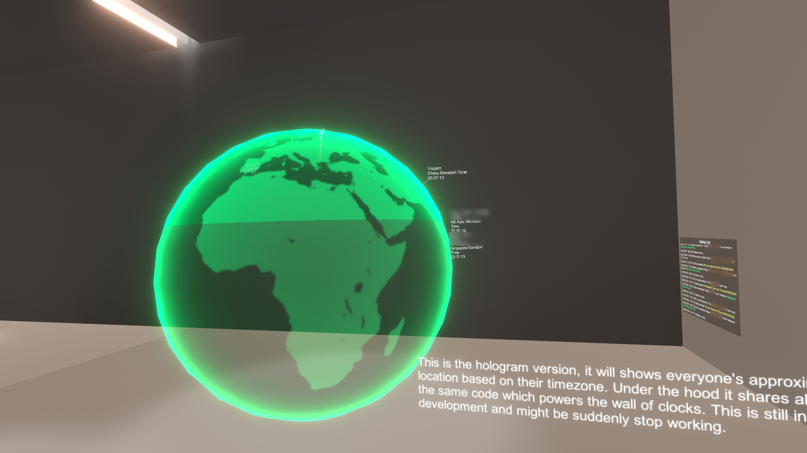

# Timezone Sync Hologram

This is a gimmick asset for VRChat worlds which shows everyone's timezones, approximate location based on the timezone and their local time in the same world instance on a hologram earth, it is powered by UdonSharp. Have a remind that this asset is only tested for desktop clients, even logic that targeted to Quest clients are coded, there is no guarantee works perfectly to Quest users.

Here is a proof-of-concept world that included this asset, you may want to have a look:
https://vrchat.com/home/launch?worldId=wrld_7b24185d-81e8-4d67-8859-7bcf9a45cf1a

Unfortunately the clock asset in the world above are restricted by its license and cannot be included with this asset package.

You can support this asset in Booth: https://xtl.booth.pm/items/3148154

## Getting Started
Before you start to put this into your world, make sure you have following stuffs installed/imported to your project:
- [Unity Editor (2018.4.20f1)](https://unity3d.com/unity/whats-new/2018.4.20)
- [The latest VRChat SDK3 for worlds](https://vrchat.com/home/download)
- [UdonSharp by Merlin](https://github.com/MerlinVR/UdonSharp/releases/)

Once you are ready, you may head into [releases](https://github.com/JLChnToZ/vrctzhologram/releases) page for download the latest `.unitypackage` file. Import it and drag the `TZ Hologram Earth` prefab into your world scene and thats it. It does not require any coding skills unless you want to change its behaviour.

## License
The code are licensed by [MIT License](LICENSE). The included [hologram shader](https://github.com/andydbc/HologramShader) and related inspector are made by Andy Duboc, licensed under [MIT License](https://github.com/andydbc/HologramShader/blob/master/LICENSE). Timezone region data are from [Timezone Boundary Builder](https://github.com/evansiroky/timezone-boundary-builder/), licensed under [Open Data Commons Open Database License (ODbL)](http://opendatacommons.org/licenses/odbl/). Cross-platform mapping data are from [TimeZoneConverter](https://github.com/mattjohnsonpint/TimeZoneConverter), licensed under [MIT License](https://github.com/mattjohnsonpint/TimeZoneConverter/blob/main/LICENSE.txt).

It is not required to credit me when you used this asset, but I will be happy if you did it.